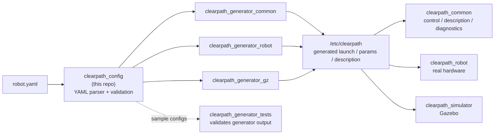

# clearpath_config

Clearpath Configuration YAML Parser

Find documentation on the Clearpath Configuration YAML and more about the Clearpath ROS 2 System on the [Clearpath Documentation](https://docs.clearpathrobotics.com/docs/ros/config/yaml/overview) webpage.

## Where this fits in the Clearpath ROS 2 stack

`clearpath_config` is the **entry point** of the Clearpath ROS 2 system. A single
`robot.yaml` file describes an entire robot (platform, sensors, mounts, manipulators, and
system settings). This package parses and validates that file into a Python object tree, which
the Clearpath *generators* then turn into launch files, parameter files, and robot descriptions.

## Architecture

The top-level [`ClearpathConfig`](clearpath_config/clearpath_config.py) class loads the YAML and
delegates each top-level key to a dedicated sub-config module. Every sub-config validates its own
section and exposes typed accessors:

| Top-level key   | Module                         | Responsibility                                        |
|-----------------|--------------------------------|-------------------------------------------------------|
| `serial_number` | `clearpath_config.py`          | Robot identity; seeds platform defaults.              |
| `version`       | `clearpath_config.py`          | Config schema version.                                |
| `system`        | `system/system.py`             | Hosts, networking, ROS domain, middleware.            |
| `platform`      | `platform/platform.py`         | Base platform model, controllers, extras.             |
| `links`         | `links/links.py`               | Static coordinate frames added by the user.           |
| `manipulators`  | `manipulators/manipulators.py` | Arms, grippers, and lifts.                             |
| `mounts`        | `mounts/mounts.py`             | Physical mounting hardware for sensors/accessories.   |
| `sensors`       | `sensors/sensors.py`           | Cameras, lidars, IMUs, GPS, etc.                       |

Shared plumbing (base classes, YAML read/write, type helpers) lives under
[`clearpath_config/common/`](clearpath_config/common). Use `read_yaml`/`write_yaml` from
`common/utils/yaml.py` rather than calling PyYAML directly, so ordering and formatting stay
consistent with the generators.

## Documentation

- [Robot YAML overview](https://docs.clearpathrobotics.com/docs/ros/config/yaml/overview) — the user-facing reference for `robot.yaml`.
- Per-section references: [serial number](https://docs.clearpathrobotics.com/docs/ros/config/yaml/serial), [system](https://docs.clearpathrobotics.com/docs/ros/config/yaml/system), [platform](https://docs.clearpathrobotics.com/docs/ros/config/yaml/platform/overview), [links](https://docs.clearpathrobotics.com/docs/ros/config/yaml/links), [mounts](https://docs.clearpathrobotics.com/docs/ros/config/yaml/mounts), [sensors](https://docs.clearpathrobotics.com/docs/ros/config/yaml/sensors/overview).
- [Generators](https://docs.clearpathrobotics.com/docs/ros/config/generators) — how the parsed config is turned into runtime files.

## Configuration Examples

Under the ***sample*** folder there are example configurations that can be used as the starting point of your `robot.yaml`. Sample files whose names contain `test` (e.g. `test_a300.yaml`) are also the fixtures consumed by [clearpath_generator_tests](https://github.com/clearpathrobotics/clearpath_generator_tests); adding or renaming one changes what CI validates.

## Contributing

See [CONTRIBUTING.md](CONTRIBUTING.md) for how to set up your environment, run the linters and tests, and submit a pull request.
